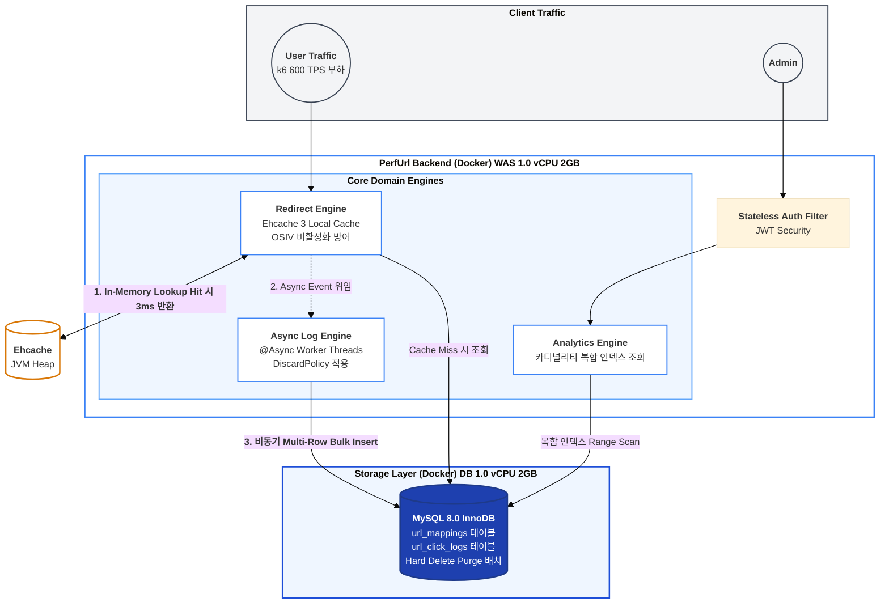
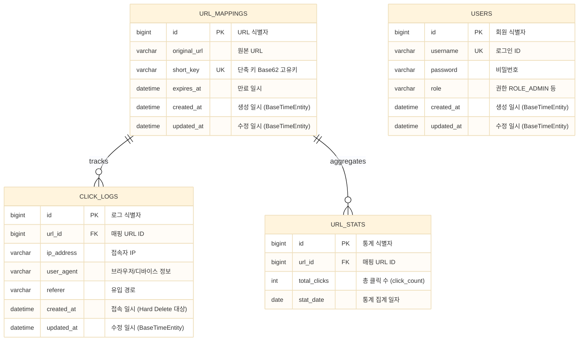

# [ PerfUrl ] 대용량 로그 수집 기반 단축 URL 리디렉션 서비스

> **핵심 가치**
> - 가혹 인프라 제약(t3.medium 모사, WAS 1.0 vCPU / DB 1.0 vCPU) 환경 ➔ 소프트웨어 아키텍처 튜닝 기반 시스템 물리적 임계점 계측 및 부하 방어
> - 피크 600 TPS 트래픽 집중 부하 ➔ 로컬 캐싱 및 비동기 파이프라인 구축으로 P50 응답 속도 3.47초에서 106ms 단축 및 부하 누락 95.9% 방어

> **핵심 성과 요약**
> - **리디렉션 성능 및 가용성 확보 ➔** Ehcache 로컬 캐시 적용으로 RDBMS 매핑 쿼리 지연 300ms에서 3ms 이하 오프로딩 및 P95 응답 지연 6.23초에서 1.72초 단축
> - **대용량 로그 적재 병목 최적화 ➔** `@Async` 워커 스레드 풀 격리 및 `DiscardPolicy` 적용으로 메인 스레드 블로킹 차단, 총 처리량 64.9% 향상 (177.9 ➔ 293.5 TPS)
> - **메모리 포화 및 GC 지연 방어 ➔** ZGC 4.5초 STW 스파이크 해소 및 힙 메모리 톱니바퀴 패턴 제어로 단일 인스턴스 20.7만 건 트랜잭션 수용
> - **통계 쿼리 스캔 최적화 ➔** 다중 조건 필터링 쿼리에 카디널리티 기반 복합 인덱스 적용으로 0.218초에서 0.003초로 조회 시간 98% 단축

---

## 1. 프로젝트 소개

- **서비스 :** 초당 대량 리디렉션 요청 처리 및 실시간 통계 분석 시스템 구축
- **예상 트래픽 및 인프라 설계 기준 :** 대규모 마케팅 유입 기준 상시 500 TPS 수용 및 AWS t3.medium 단일 Pod 제약 환경 기반 사전 장애 예방 설계 및 검증

**[ PerfUrl ]** 은 긴 URL을 단축 URL로 변환하고, 사용자 접속 통계를 수집하는 웹 서비스입니다. 

단순한 기능 구현을 넘어, 대규모 트래픽이 집중되는 상황에서 **데이터베이스 I/O 병목, 톰캣 활성 스레드 마비, JVM 메모리 포화** 등 시스템의 물리적 임계점을 k6와 Scouter APM을 통해 정량적으로 계측하고, 이를 소프트웨어 아키텍처 튜닝으로 돌파하는 엔지니어링 역량 향상에 주력했습니다.

### 주요 도메인 기능
- **리디렉션 (Redirect) 및 핫키 최적화**
  - Base62 인코딩 기반 단축 URL 생성 및 302 리디렉션
  - `Ehcache` 로컬 캐싱을 통한 핫키(Hot Key) RDBMS 조회 부하 100% 오프로딩
- **클릭 로그 통계 (Analytics)**
  - 접속 IP, User-Agent 기반 상세 클릭 통계 비동기(`@Async`) 분리 수집
  - Soft Delete 방치로 인한 인덱스 비대화 경계 및 Hard Delete Purge 배치 파이프라인 구축
- **대시보드 (Admin)**
  - JWT 인증 기반 관리자 백오피스 및 복합 인덱스 활용 통계 대시보드 제공

### 디렉토리 구조 (Feature-driven Architecture)
```text
src/main/java/be/url_backend
├── common                      # 전역 공통 인프라 및 횡단 관심사
│   ├── config                  # Cache, Async, Security 등 설정
│   ├── dto                     # 공통 응답 규격
│   ├── exception               # GlobalExceptionHandler 및 표준 에러 규격
│   ├── security                # JWT 필터 및 Stateless 인증 인가
│   └── util                    # Base62Utils, JwtUtil 등 유틸리티
└── feature                     # 도메인 주도 패키지 (비즈니스 로직 응집)
    ├── url                     # URL 단축 및 리디렉션 핵심 로직
    ├── log                     # 비동기 클릭 로그 수집 및 Purge 전략
    ├── stats                   # 클릭 로그 기반 통계 및 집계
    └── admin                   # 관리자 인증 및 대시보드
```

---

## 2. 시스템 전체 아키텍처



---

## 3. 기술 스택

| Category | Technology | Reason for Selection |
| --- | --- | --- |
| **Language** |  | LTS 버전의 안정성 및 Record 패턴, ZGC 등 최신 메모리 관리 기법 활용 |
| **Framework** |   | 도메인 비즈니스 로직 집중 및 의존성 관리 최적화 |
| **Database** |   | 로컬 캐싱(Ehcache)을 통한 I/O 격리 및 대량 로그 데이터 처리 (MySQL) |
| **ORM** |   | 객체 지향적 설계 생산성 확보 및 통계 쿼리 타입 안정성 보장 |
| **Infra / Test** |   | Docker CPU/Memory 리소스 쿼터 제한을 통한 가혹 환경 모사 및 k6 부하 테스트 수행 |

---

## 4. 핵심 엔지니어링 최적화 딥다이브

> 하드웨어 증설(Scale-up) 없는 소프트웨어 아키텍처 튜닝 기반 병목 해결 프로세스

### [ Deep-Dive 1 ] 리디렉션 트래픽 집중 및 RDBMS I/O 병목 ➔ 로컬 캐시 및 비동기 로깅 파이프라인 구축

**Q. 트래픽 집중 시 발생하는 DB I/O 병목 및 활성 스레드 마비(Count 200) 리스크 방어 전략**

- **문제 상황 AS-IS**
  - 핫키 트래픽 편중 시 단일 트랜잭션 내 **Read(매핑 쿼리) + Write(로그 적재) 강결합**으로 SQL Time 최대 300ms까지 수직 상승
  - 매핑 지연으로 인한 톰캣 워커 스레드 대기 ➔ **Active Service Count 200 수준 포화 및 스레드 풀 정체 식별**
  - 응답 지연 객체 누적에 따른 힙 포화 ➔ **최대 4.5초 ZGC STW 스파이크** 발생 및 43,519건 부하 누락 오류 확인

```mermaid
%%{init: {'theme': 'base', 'themeVariables': { 'fontSize': '13px', 'fontFamily': 'Pretendard, sans-serif'}}}%%
graph TD
    subgraph AS_IS_4 ["<b>[AS-IS] 트랜잭션 강결합 및 시스템 정체</b>"]
        A_User((User Traffic)) --> A_Main["<b>Main Thread</b><br/>리디렉션 및 로그 저장 강결합"]
        A_Main --> A_DB[(MySQL DB)]
        A_DB -.-> |"<b>6.23s 지연 (P95)</b><br/>활성 스레드 정체 및 GC 지연"| A_User
    end

    subgraph TO_BE_4 ["<b>[TO-BE] 고가용성 리디렉션 파이프라인</b>"]
        subgraph Phase1 ["<b>Phase 1: 실시간 리디렉션 (Read)</b>"]
            B1((User Traffic)) -- "GET /short-url" --> B2{"<b>1 | Local Cache</b><br/>Ehcache Lookup"}
            B2 -- "<b>Hit</b>" --> B3["<b>1.72s 응답 (P95) / 106ms (P50)</b><br/>302 Redirect"]
            B2 -- "Miss" --> B_DB_R[(MySQL DB)]
            B_DB_R --> B3
        end

        subgraph Phase2 ["<b>Phase 2: 비동기 로그 격리 및 데이터 파기 (Write)</b>"]
            B3 -.-> |"<b>2 | Non-Blocking</b><br/>Async Event"| B4["<b>3 | Worker Thread Pool</b><br/>@Async (ThreadPoolTaskExecutor) 분리"]
            B4 -- "<b>Discard Policy</b><br/>거부 정책 기반 대기열 포화 억제" --> B_DB_W[(MySQL DB Log Table)]
            B_DB_W -.-> |"<b>Purge Batch</b><br/>만료 데이터 Hard Delete 파기"| B_Purge["<b>DB Buffer 풀 보호</b>"]
        end
    end

    style AS_IS_4 fill:#fdf2f2,stroke:#f87171,stroke-width:2px,stroke-dasharray: 8 4
    style TO_BE_4 fill:#f8fafc,stroke:#334155,stroke-width:2px
    style A_DB fill:#E0F2FE,stroke:#ef4444,stroke-width:2.5px
    style B_DB_R fill:#E0F2FE,stroke:#3B82F6,stroke-width:2px
    style B_DB_W fill:#E0F2FE,stroke:#3B82F6,stroke-width:2px
    style B_Purge fill:#ecfdf5,stroke:#059669,stroke-width:1.5px
    style B2 fill:#ffffff,stroke:#d97706,stroke-width:1.5px
    style B4 fill:#ffffff,stroke:#339af0,stroke-width:1.5px
    style B3 fill:#ecfdf5,stroke:#059669,stroke-width:2px
    style A_User fill:#f3f4f6,stroke:#374151
    style B1 fill:#f3f4f6,stroke:#374151
```



- **해결 전략 및 아키텍처 (TO-BE)**
  - **Ehcache 로컬 캐싱 ➔** 핫키 매핑 조회를 JVM 힙 메모리에서 처리하여 RDBMS 부하 원천 차단 (SQL Time 300ms ➔ 3ms 이하 통제)
  - **@Async 비동기 워커 스레드 풀 격리 ➔** 클릭 로그 적재(Write) 작업을 `async-worker-N` 스레드로 위임하여 메인 톰캣 스레드 I/O 블로킹 방어
  - **거부 정책 `DiscardPolicy` ➔** 큐 포화 시 메인 스레드 대기 방지를 위해 로그를 버리는 정책을 채택, 리디렉션 가용성 우선 확보
  - **Soft/Hard Delete Purge 전략 ➔** 인덱스 블록 비대화 방지 및 디스크 버퍼 풀 효율 확보를 위해 만료 로그 Hard Delete 배치 수행

- **정량적 실측 성과 (AWS t3.medium 모사 환경 6분간 0 ➔ 600 TPS 계측)**

  | 측정 지표 | AS-IS (Sync 강결합) | TO-BE (Async + Ehcache) | 개선 효과 |
  | :--- | :--- | :--- | :--- |
  | **평균 처리량 (TPS)** | 177.9 TPS | **293.5 TPS (피크 550 TPS)** | **64.9% 수용력 확장** |
  | **P50 Latency (중앙값)** | 3.47초 (3,470ms) | **0.1초 (106ms)** | **96.9% 지연 시간 단축** |
  | **P95 Latency** | 6.23초 (6,230ms) | **1.72초 (1,720ms)** | **72.3% Tail Latency 방어** |
  | **총 누적 트랜잭션** | 64,480건 | **106,234건 (APM 기준 20.7만)** | **동일 시간 처리량 64% 폭증** |
  | **부하 누락 (Dropped)** | 43,519건 (시스템 붕괴) | **1,764건** | **95.9% 부하 누락 방어** |
  | **RDBMS SQL Time** | 100~300ms 지연 | **3ms 이하 (0ms 평면)** | **쿼리 부하 100% 오프로딩** |

<details>
<summary><strong>상세 부하 테스트 지표</strong></summary>
<div markdown="1">
<br>

**[ AS-IS ] 트랜잭션 강결합 및 스레드 마비 (43,519건 누락)**


**[ TO-BE ] 비동기 로그 격리 및 가용성 확보 (1,764건 누락 방어)**

</div>
</details>

<br>

### [ Deep-Dive 2 ] 복합 인덱스 설계를 통한 통계 조회 성능 최적화

**Q. 대용량 로그 데이터 조회 시 발생하는 Full Table Scan 지연 해결 전략**

- **문제 상황 AS-IS**
  - 50만 건 이상의 데이터 적재 환경에서 IP와 날짜(`created_at`) 다중 조건 필터링 시 쿼리 응답 지연 (0.218초 소요)
  - `EXPLAIN` 분석 결과 조건에 부합하는 적절한 인덱스가 없어 Full Scan 발생 인지

- **해결 전략 및 아키텍처**
  - **카디널리티 기반 복합 인덱스 적용 ➔** 카디널리티가 높은 `ip_address`와 조회 범위 지정이 필요한 `created_at` 컬럼 결합 설계
  ```sql
  CREATE INDEX idx_ip_created ON click_log (ip_address, created_at);
  ```

- **정량적 실측 성과**
  - **SQL 처리 시간 ➔** 0.21887초에서 **0.00372초**로 약 **98% 쿼리 비용 삭감**
  - 인덱스 적용 전후 쿼리 실행 계획 검증 완료

---

## 5. 트러블 슈팅 및 설계 회고

### 1. Redis 글로벌 캐시 대신 Ehcache 로컬 캐시를 선택한 이유
- 단축 URL 리디렉션은 네트워크 I/O 패킷 비용조차 극도로 최소화해야 하는 Ultra Low-Latency 도메인입니다. vCPU 2개 수준의 자원 제약 환경에서는 Redis 연동 네트워크 RTT(1~2ms)조차 지연 요소가 될 수 있으므로, JVM 힙 메모리를 직접 조회하여 0ms에 근접한 속도를 내는 **Ehcache 로컬 캐싱**이 아키텍처 목적에 부합한다고 판단했습니다. 향후 서버 Scale-out 시 분산 환경 정합성을 위한 Redis 마이그레이션 트레이드오프를 인지하고 있습니다.

### 2. 비동기 워커 큐 포화 시 `DiscardPolicy` 선택
- 대용량 트래픽 유입 시 비동기 큐가 가득 찼을 때 `CallerRunsPolicy`를 적용하면 메인 리디렉션 톰캣 스레드가 로그 적재 작업을 떠안게 되어 다시 I/O 블로킹이 발생합니다. 단축 URL 서비스의 최우선 가치인 **'빠른 리디렉션'**을 사수하기 위해, 로그 유실 리스크를 감수하더라도 신속히 요청 큐를 버리는 `DiscardPolicy`를 적용하여 시스템 연쇄 장애(Cascading Failure)를 차단했습니다.

### 3. Soft Delete 방치 경계와 Hard Delete Purge 전략
- 클릭 로그와 같은 대규모 이력성 테이블에 일률적으로 Soft Delete(`deleted_at`)를 적용하면, `deleted_at IS NULL` 탐색으로 인해 인덱스 블록이 비대해지고 디스크 버퍼 풀을 낭비하게 됩니다. 따라서 수명 주기(TTL)가 만료된 로그는 **Hard Delete Purge 배치**를 통해 주기적으로 파기하여, RDBMS 인덱스 스캔 블록을 깨끗하게 통제하고 버퍼 풀 오염을 방어했습니다.

### 4. 고부하 환경 OSIV 비활성화 (DB 커넥션 고갈 방어)
- 트래픽 급증 시 View 렌더링 응답 시점까지 DB 커넥션을 점유하는 OSIV(Open Session In View)의 특성으로 인해 커넥션 풀 고갈 리스크가 있음을 확인했습니다. `spring.jpa.open-in-view: false` 설정으로 트랜잭션 종료 즉시 DB 커넥션을 HikariCP에 반환하도록 튜닝했으며, `LazyInitializationException`은 Service 계층 DTO 변환으로 사전 방어했습니다.

---

## 6. ERD 데이터베이스 모델링



---

## 7. 프로젝트 실행 및 테스트

### 환경 요구 사항
- JDK 21
- Docker & Docker Compose (프로덕션 모사 환경)
- k6 (부하 성능 테스트)

### 로컬 빌드 및 실행
```bash
# 1. Repository Clone
git clone https://github.com/UrlOps/perfurl-backend.git
cd perfurl-backend

# 2. Build
./gradlew clean build -x test

# 3. Docker Compose 실행 (t3.medium 모사 제약 적용)
docker compose -f docker-compose.prod.yml up -d --build

# 4. 리소스 점유 실시간 확인
docker stats
```

### k6 부하 테스트 
6분간 0 -> 600 TPS 점진적 부하 인가 시나리오 구동:
```bash
k6 run -e TARGET_URL=http://localhost:8080 -e SHORT_KEY={생성된_단축키} scripts/k6_stress_test.js
```

---

## 8. 주요 시스템 화면

<details>
<summary><strong>프로젝트 주요 화면 보기</strong></summary>
<div markdown="1">
<br>

### 메인 서비스 화면

<br><br>

<br><br>


<br>

### 관리자 로그인

<br><br>

### 백오피스 통계 화면

</div>
</details>
